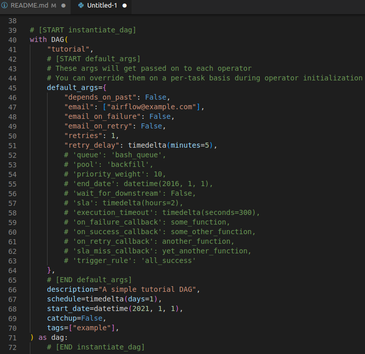

# airflow_interview_preparation
you already know what this is about

## Theorical Questions Section

### Theorical Question 1

Do you know the three main components of Airflow ?

<b>Answer</b>

webserver: this is the User Interface, the frontend.

scheduler: this is the part of Airflow that execute the logic, the backend

cli: the command line interface for automating tasks.

<b>Source</b>

My own experience

### Theorical Question 2

From this picture.

1. Do you know what line 40  and 41 are for
2. Do you understand what arguments mentioned from line 45 to line 70 are for ? 

<b>Answer</b>

1. Line 40 is where we are creating The Dag 
2. line 41 is for definig the name of the DAG
3. Depends_on_past means that a task can only run if the previous run of the task in the previous DAG Run succeeded
4. That is the email that will receive notification 
5. Queue: By default, all tasks run in the default worker queue. To run tasks on a different worker queue, assign the task to the worker queue in your DAG code.
6. pool: Pools allow you to limit parallelism for an arbitrary set of tasks, allowing you to control when your tasks are run. They are often used in cases where you want to limit the number of parallel tasks that do a certain thing. For example, tasks that make requests to the same API or database, or tasks that run on a GPU node of a Kubernetes cluster.
7. priority weights are used along side with pools to define which task within the pool is executed first
8. end_date is a date beyond which your DAG won't run
9. wait_for_downstream: when set to true, an instance of task X will wait for tasks immediately downstream of the previous instance of task X to finish successfully before it runs. This is useful if the different instances of a task X alter the same asset, and this asset is used by tasks downstream of task X. Note that depends_on_past is forced to True wherever wait_for_downstream is used. 
10. sla: (in my own experience don't use it). The idea is great, is suppose to notify if a task is taking longer than a pre-established time but it generate a lot of false alarms
11. execution_timeout is the  max time allowed for the execution of this task instance, if it goes beyond it will raise and fail.
12. Callbacks are python functions defined by the user to be executed in case of failure or success

<b>Source</b>

https://airflow.apache.org/docs/apache-airflow/stable/_modules/airflow/example_dags/tutorial.html

